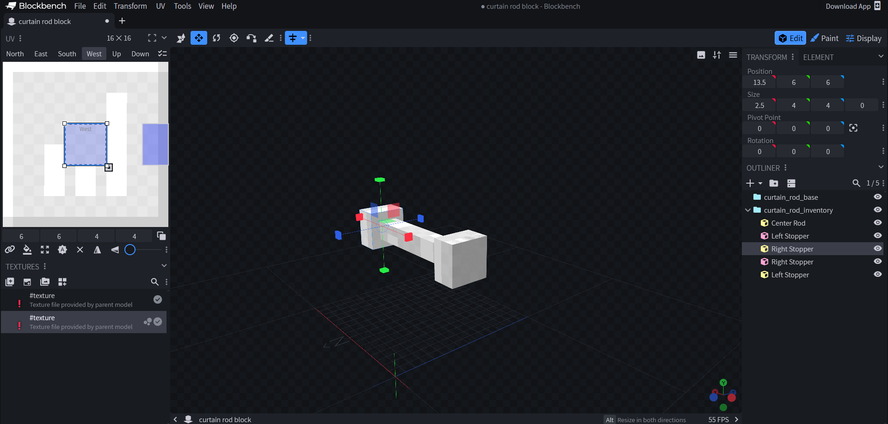
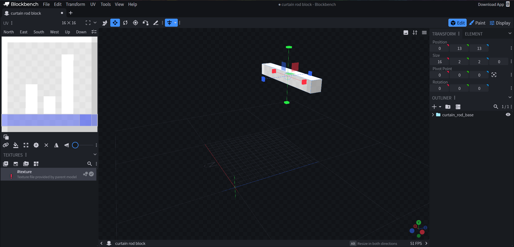
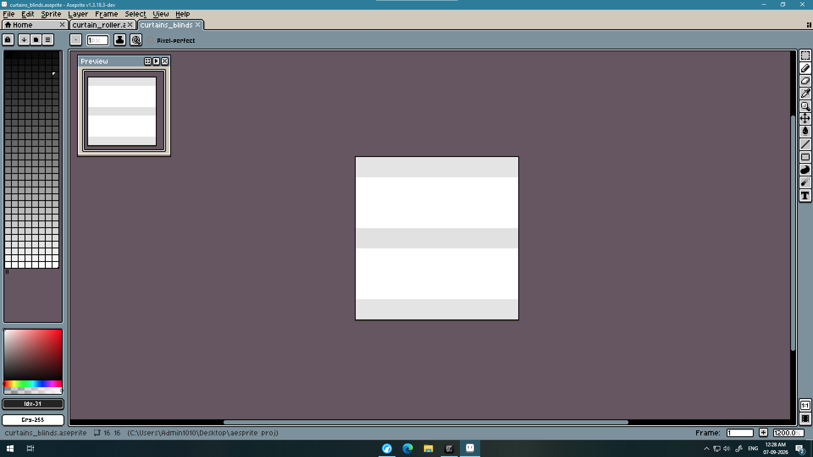
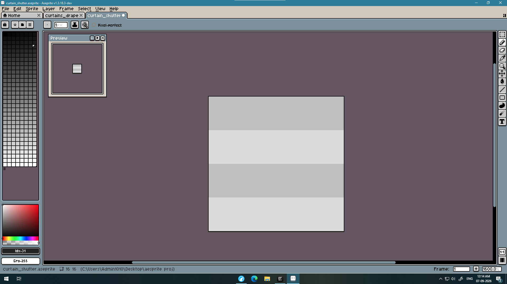
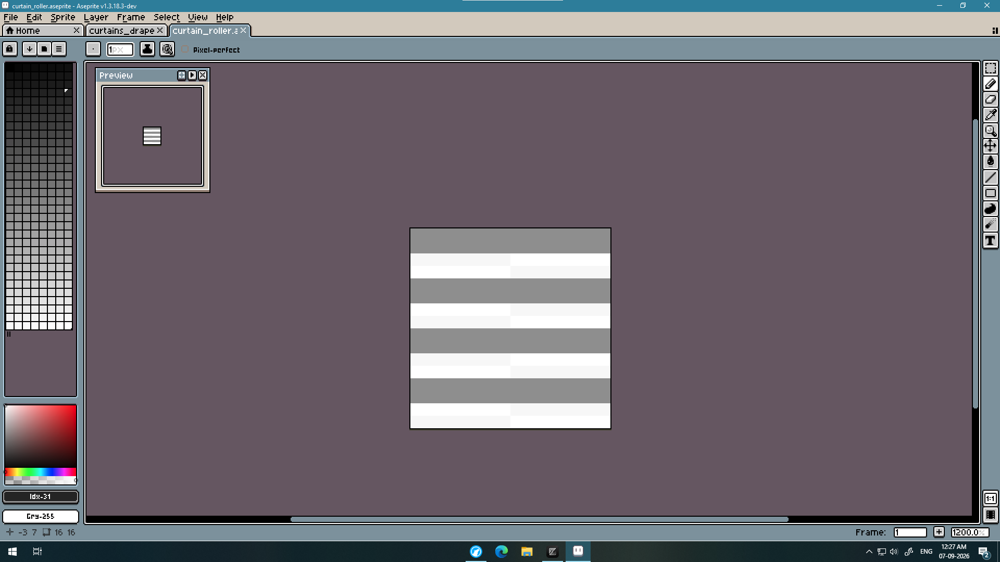
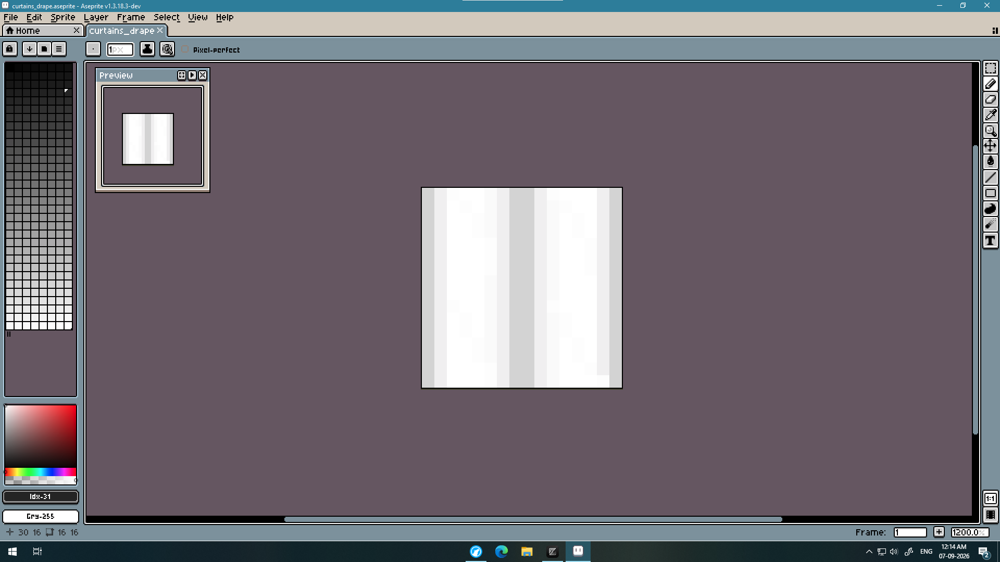
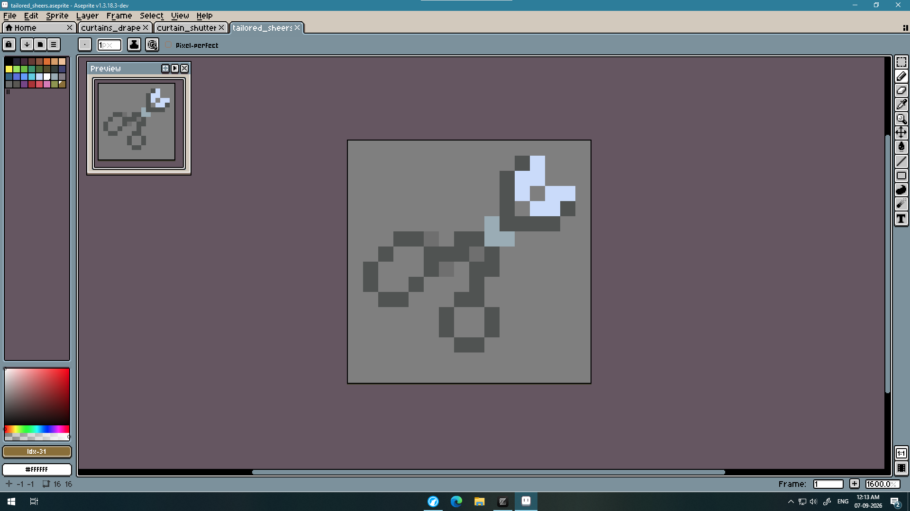

## Day 1 (27/8/2026) (~6.5 hours)

This is the start of the project. My idea initially came from having to use banners as curtains in one of my worlds. I had some previous experience with cloth physics so I decided to give Soft Curtains a try.

Starting with a Fabric Example Mod template for 26.2, I replaced the mod-id with `softcurtains`. Then I made the `CurtainRodBlock`, `CurtainBlockEntity`, and `CurtainBlockEntityRenderer`.

This is the first time I am directly doing a block related mod and so I got stuck very quickly. I opened blockbench and created a 3D model for the curtain rod and its variants, which took me around 15 minutes.




This is when I ran into a problem. My curtains werent actually being rendered.
Funny enough, I forgot to register my renderer xD. That took some time to realise ;>. Also, I originally planned on directly using the wool texture by minecraft for the curtains. However, they looked quite boring.

Then I just focused on adding the models to code, setting up its hitbox (this took the majority of my time), and dealing with like what a thousand registries to get to see my block in game.

For the curtains, they were basic flat faces with a wool texture, and with a veryyy high swaying like in a tornado or smth.

Thats all I did.
___

## Day 2 and 3 (28-29/8/26) (~8 hours)

Today it took me around 6 hours for coding and 3 hours figuring out why the heck fabric's data generation would keep crashing. 

Fabric has a data generation API to easily create item, and block models beforehand without having to manually write each JSON file. My curtain rod alone has 6 model variants (base, left stopper, right stopper, middle stopper and inventory), which need to be created for every type of material (like every wood variant). This alone brings almost 80+ files, not including blockstate files.

So it kept crashing on running data-gen because data-gen was running on `SERVER` enviornment, while the respective mixins for data-gen run on `CLIENT` enviornment. This is not supposed to happen by using
```java
	configureDataGeneration {
			client = true
			strictValidation = false
	}
```
but it was still crashing.

I tried to find a solution. I looked up online, asked AI, but all related discussions to the error didnt provide any sufficient answers.
So I instead injected my own mixins with similar code to fabric's API, (although riskier) and voila, it worked smoothly. 
Although I dont understand the issue fully, this explaination (^) feels reasonable.

I also added curtain dragging, which was completely 3D vector maths which I am not fully familiar with (especially with projection), so I took some help from AI for getting the functionality in.

I managed to fail 2 times while correcting the build.gradle for github-actions.
The curtain rod model was revised and made thinner, along with more misc features like redstone power, loottable and crafting recipes which were the easiest parts. 

## Day 4 and 5 (2-3/9/26) (~3 hours)

I spent this time adding extra features like "fixing" bad lighting on the faces of the curtains, more interactive cloth physics and curtain styles.

The normals of the faces of curtains were reversed (cause of the bad lighting :/), and curtain rod had a hollow face because I unkowningly deleted the face's definition in the model file.

Apart from bugs, I also added tailored sheers to cycle between the curtain styles, and the english language translation for all the items. A lot more untracked time was spent googling and reading docs on how to register the items, CODECs for the curtain styles, and fixing a broken data-gen model provider.

For physics, I initally wanted it so that players would warp and bend the cloth like a blender fabric or something. This idea turned out to be way more complex and beyond the scope of my existence for a block game. So I just added weather and wind physics. Oh and also, the curtains sway left and right when you drag them.

## Day 6 (4/9/2026) (~9 hours total, 4 hours coding)

This was a big day. I spent many many hours drawing pixel art for the first time in my life in aesprite (self-compiled), and with the added bonus of not being good at art, I picked up a digital pencil for the first time.
Good to say that was a pleasant experience. My color pallete was just 10 colors, all being different shades of black and white. 

I had to draw all the curtain textures in grayscale because of in-game tinting.

I also added color blending to curtain drapes, rollers and shutters so different colored segments on the curtains would feel much more nice. I did several iterations on the blending formula, all derived from linear blending, before choosing what I thought looked best.

Unfortunately, I forgot to lapse this whole session :( 
<br>i'll put the final images for each texture over here:








I also added raycasting to better control the dragging of the curtains from anywhere.

Fabric's API was giving another one of the same bugs when I tried to create tinted item models of the curtain items through the data-gen.
This time, I had to hack my way to make it not crash. This hack was also needed because of custom Curtain Styles property that every curtain shared. But after this ducktape, it worked instantly.

```java
//Need to bootstrap the client so that CurtainStyleProperty is registered in the SelectItemModelProperties registry
    static {
        ClientBootstrap.bootstrap();
        CurtainsBlocks.register();
        CurtainsItems.register();

        try {
            SelectItemModelProperties.ID_MAPPER.put(
                    SoftCurtainsMain.id("curtain_style"),
                    CurtainStyleProperty.TYPE
            );
        } catch (IllegalArgumentException | IllegalStateException ignored) {}
    }
```

And with this, I added several more curtain item models, their block textures, polishing physics code with the help of AI, and fixing dragging bugs.

### Day 7 (5/9/2026) (~4 hours total, ~1 hour coding)

I spent another day making textures for the curtain items and the ICON, the most difficult being the drapes.

Today was also the day I brushed up the readme file, added GIFs for each curtain, a table for all the actions and their respective keybinds that are possible, added `pale oak` curtain material, recipe for the tailoring sheers, and some code refactoring + cleanup.

Coding-wise, it was just an hour. A big chunk of the time was spent on re-running minecraft after every change in any of the texture (because it wasn't reloading the textures on runtime :sob:), making display area for the GIFs, and coloring the item textures properly. Watching pixel art tutorials was the best part!!! /s

I also spent some time recording and editing the GIFs, making screenshots for the gallery and creating a new project on modrinth, and writing it's description.

My plans for this mod was to submit for Hackcraft, and so I didnt record any Lapse footage or maintained this journal from the very start. I later changed my plan to submit it for Pixl event.

You can also find these textures in [here](src/main/resources/assets/softcurtains/textures)

## Day 8 (6/9/26) (~30 minutes)

I did not a lot of coding today, just polishing up the readme,
adding license and preview images to the github. I did fix a issue about curtains with different styles connecting together that I found while making one of the GIFs. 

I also did some more testing, by running the mod outside of the development enviornment, and testing it on a Fabric server. It worked normally, thankfully.

After this, I ran the build file and uploaded the produced `softcurtains-1.0.0.jar` to modrinth as a `beta`. Submitting the project for review.

Today is also the day I spent 2 hours writing this journal.
